# feeding_cylindrical_parts_alg

基于 **YOLO 实例分割** 的圆柱/圆盘零件 **6D 位姿估计库**。相机采集与位姿算法 **解耦**，通过统一配置 `config/pose_params.yaml` 管理分割、类别几何与两种位姿算法，便于集成到产线或其他视觉系统。

**长度单位统一为米 (m)**；图像几何阈值为像素 (px)。

## 工程定位

本工程面向 **单个或多个圆盘形目标**（如圆柱件 `feeding_cylindrical_parts`、预投料台圆孔 `pre_feeding_table_hole`）：用分割 mask 定位目标，再估计其在 **相机坐标系** 下的位姿 `T_cam_obj`（4×4 齐次矩阵）。**同一套圆盘 PnP / 重心算法** 复用于所有类别，仅 **每类半径 `radius_m`** 不同。

与同目录下其他料台工程的区别：

| 工程 | 思路 |
|------|------|
| **feeding_cylindrical_parts_alg（本工程）** | YOLO 逐目标分割 + 已知半径圆盘 PnP / 深度重心 |
| `feeding_table_alg1` | 整板 mask 四边形 + 矩形 PnP |
| `feeding_table_alg3` | YOLO 逐圆孔 + 6×8 网格拓扑匹配 + PnP |

## 工程结构

```
feeding_cylindrical_parts_alg/
├── README.md
├── main.py                      # RealSense D435 实时演示入口
├── paths.py                     # 工程根路径、默认 models/best.pt
├── visualization.py             # mask / 椭圆 / 位姿轴可视化
├── requirements.txt
├── config/
│   └── pose_params.yaml         # 统一参数（必配）
├── models/
│   └── best.pt                  # YOLO 分割权重（需自行放置）
├── algorithm/
│   ├── engine.py                # CirclePoseEngine 统一入口
│   ├── types.py                 # AlgorithmInput / TargetPose / 算法 ID
│   ├── config_loader.py         # YAML → PoseParams
│   ├── segmentation_yolo.py     # YOLO → mask + 轮廓
│   ├── pose_pnp.py              # 算法 0：椭圆周向 PnP
│   └── pose_centroid.py         # 算法 1：mask 深度重心
└── camera/
    └── realsense_d435.py        # D435 采集（演示用，可替换）
```

## 原理概述

### 要估计什么

对每个检测到的圆盘目标，输出相机系下的 **`pose_4x4`**：

```
T_cam_obj = [ R | t ]
            [ 0 | 1 ]
```

- `t`：物体原点在相机系下的位置 **(m)**
- `R`：物体坐标系相对相机系的旋转

物体坐标系定义（算法 0 PnP）：

- 原点在圆盘中心
- 圆盘位于 **XY 平面（Z=0）**
- 半径 `radius_m` 由配置中该类别的 `classes.*.radius_m` 给定（如 0.0275 m）

算法 1（重心）只估计 **平移**，旋转为单位阵 `R=I`，适合只关心空间位置、对姿态要求不高的场景。

### 相机系（OpenCV / RealSense 彩色）

- **+X**：右
- **+Y**：下
- **+Z**：前（光轴）

### 两种位姿算法

| ID | 名称 | 输入 | 输出 | 适用场景 |
|----|------|------|------|----------|
| **0** | PnP | RGB + 内参 + **已知半径** | 完整 6D `T_cam_obj` | 圆盘半径已知、需法向/姿态 |
| **1** | 重心 | RGB + **对齐深度 (m)** + 内参 | 仅平移，`R=I` | 只需 3D 位置、有可靠深度 |

算法可按 **全局默认**、**按类别** 或 **单帧命令行覆盖** 选择。

## 处理流程

```mermaid
flowchart TD
    A[AlgorithmInput: RGB + K + dist + 可选 depth] --> B[YOLO 实例分割]
    B --> C[mask 映射原图 + 轮廓多边形]
    C --> D{algorithm_id?}
    D -->|0 PnP| E[fitEllipse 拟合椭圆]
    E --> F[椭圆周采样 n 点 ↔ 3D 圆周采样]
    F --> G[solvePnPRansac 多相位尝试]
    G --> H[深度/法向/重投影校验]
    H --> I[T_cam_obj 4×4]
    D -->|1 重心| J[mask 腐蚀去边缘]
    J --> K[有效深度点反投影]
    K --> L[3D 重心均值]
    L --> M[T_cam_obj 平移 only]
    I --> N[TargetPose 列表]
    M --> N
```



### 1. 分割（`segmentation_yolo.py`，与 `feeding_table_alg3` 对齐）

| 步骤 | 说明 |
|------|------|
| 推理分辨率 | 默认 `imgsz=1280`；`0` 表示自动 `max(H,W)`，避免 720p 用 640 推理 |
| Retina mask | `retina_masks=true`，在原图分辨率输出 mask |
| 回原图 | `ops.scale_masks` 将 letterbox mask 映射到原图（勿 `cv2.resize`） |
| 轮廓 | 从还原后的二值 mask 用 `findContours` 提取，与可视化 mask 一致 |
| 过滤 | 按 `conf` / `iou` / `class_ids` 过滤类别 |

输出每个实例：`mask (H,W)`、`contour (N,2)`、`class_id`、`confidence`。

训练时 `imgsz=640` 可以，但 **推理** 若对 1280×720 仍用 640：图像 letterbox 缩到约 640×360，mask 再放大回原图 → 边缘锯齿、圆心漂移。本工程默认 **`imgsz: 1280`** + **`retina_masks: true`**。

### 2. 算法 0：分割 + 圆盘 PnP（`pose_pnp.py`）

| 步骤 | 说明 |
|------|------|
| 椭圆拟合 | 轮廓 `cv2.fitEllipse` |
| 圆周采样 | 在椭圆上均匀取 `n_samples`（默认 12）个 2D 点 |
| 3D 模型 | 半径 `radius_m` 的圆盘圆周点，Z=0 |
| 相位消歧 | 尝试 4 种周向相位（0, π/2, π, 3π/2） |
| PnP | `cv2.solvePnPRansac`（SQPNP） |
| 校验 | 目标在相机前方；法向与视线夹角；平均重投影误差 ≤ `max_reproj_mean` |
| 法向规范 | 保证物体 +Z 在相机系 Z 分量为正 |

### 3. 算法 1：分割 + 深度重心（`pose_centroid.py`）

| 步骤 | 说明 |
|------|------|
| mask 腐蚀 | 开运算去掉 mask 边缘噪声 |
| 深度筛选 | 有效深度 ≥ `min_depth_m` 的像素 |
| 反投影 | 每个有效像素 → 相机系 3D |
| 位姿 | 取 3D 点均值作为平移；`R = I` |

### 4. 统一引擎（`engine.py`）

```text
CirclePoseEngine(params)
  → run(AlgorithmInput) → AlgorithmOutput.targets[]
```

- 初始化时加载 YOLO 与全部配置；
- 每个检测实例按 `class_id` 查 `radius_m`、`algorithm_id`、是否 `enabled`；
- 支持单帧 `algorithm_id` 覆盖配置。

## 统一参数 `config/pose_params.yaml`

| 区块 | 作用 |
|------|------|
| `algorithm.default_id` | 全局默认位姿算法：`0`=PnP，`1`=重心 |
| `segmentation` | 模型路径、`conf`、`iou`、`imgsz`、`retina_masks`、可选 `class_ids` |
| `defaults` | 未单独配置的类别的默认 `radius_m`、`algorithm_id` |
| `yolo_class_names` | 与训练 `data.yaml` 一致的 id→名称表，用于校验 `classes` 键名 |
| `classes` | **按类别名**配置 `class_id`、`radius_m`、`algorithm_id`、`enabled` |
| `algorithm_pnp` | 算法 0 全局参数 |
| `algorithm_centroid` | 算法 1 全局参数 |

### 类别配置示例（多类别）

当前模型类别（与 `yolo/yolov8/datasets/seg_factory.yaml` 一致）：

| class_id | 名称 | 默认半径 |
|----------|------|----------|
| 0 | `feeding_cylindrical_parts` | 0.0275 m |
| 1 | `pre_feeding_table_hole` | 0.030 m（请按实物标定） |

```yaml
yolo_class_names:
  0: feeding_cylindrical_parts
  1: pre_feeding_table_hole

algorithm:
  default_id: 0

segmentation:
  model: models/best.pt
  conf: 0.25
  iou: 0.5
  imgsz: 1280
  retina_masks: true
  class_ids: null          # null=推理所有已启用类别；或 [0] / [1] 只跑子集

classes:
  feeding_cylindrical_parts:
    class_id: 0
    radius_m: 0.0275
    enabled: true
    algorithm_id: 0

  pre_feeding_table_hole:
    class_id: 1
    radius_m: 0.030        # 圆孔半径，按实物修改
    enabled: true
    algorithm_id: 0
```

新增圆盘类：在 `classes` 与 `yolo_class_names` 中各增加一项，填写不同的 `class_id` 与 `radius_m`。`enabled: false` 可临时关闭某类而不改模型。

未在 `classes` 登记的 `class_id`：使用 `defaults`，`class_name` 输出为 `class_{id}`。

### 算法 0 主要参数

| 参数 | 默认 | 说明 |
|------|------|------|
| `n_samples` | 12 | 圆周采样点数 |
| `reproj_thresh` | 6.0 px | RANSAC 重投影阈值 |
| `max_reproj_mean` | 10.0 px | 成功判据：平均重投影上限 |
| `min_depth_m` | 0.02 m | 目标中心最小深度 |
| `min_normal_view_dot` | 0.05 | 法向与视线最小对齐 |

### 算法 1 主要参数

| 参数 | 默认 | 说明 |
|------|------|------|
| `mask_erode_kernel` | [9, 9] | mask 腐蚀核 |
| `min_depth_m` | 0.05 m | 有效深度下限 |
| `min_points` | 10 | 最少有效 3D 点数 |

## 集成 API（核心）

### 调用流程

```text
load_pose_params("config/pose_params.yaml")
        ↓
CirclePoseEngine(params)     # 初始化一次
        ↓
engine.run(AlgorithmInput)   # 每帧
        ↓
AlgorithmOutput.targets[] → TargetPose
```

### 初始化

```python
from algorithm.config_loader import load_pose_params
from algorithm.engine import CirclePoseEngine
from algorithm.types import AlgorithmInput, ALGO_PNP

params = load_pose_params()  # 默认 config/pose_params.yaml
engine = CirclePoseEngine(params)
```

### 每帧输入：`AlgorithmInput`

| 字段 | 类型 | 说明 |
|------|------|------|
| `rgb` | `(H,W,3)` BGR `uint8` | 彩色图 |
| `depth` | `(H,W)` `float32` **m** 或 `None` | 算法 1 必填，与 rgb 对齐 |
| `K` | `(3,3)` | 内参 (px) |
| `dist_coeffs` | `(5,)+` | 畸变系数 |
| `algorithm_id` | `0` / `1` / `None` | `None` 时读配置；非空则整帧覆盖 |

### 每帧输出：`TargetPose`

| 字段 | 说明 |
|------|------|
| `pose_4x4` | 相机系 **T_cam_obj**，平移 **m** |
| `class_id` / `class_name` | YOLO 类别 |
| `algorithm_id` | 实际使用的算法 0/1 |
| `radius_m` | 该类使用的圆盘半径 (m) |
| `confidence` | 检测置信度 |
| `success` / `message` | 是否成功 / 失败原因 |
| `mask` / `ellipse` | 可视化辅助 |

失败时勿直接使用 `pose_4x4`，需检查 `success`。

```python
out = engine.run(AlgorithmInput(rgb=bgr, depth=None, K=K, dist_coeffs=dist))
for t in out.targets:
    if not t.success:
        continue
    T = t.pose_4x4
    print(t.class_name, t.algorithm_id, t.radius_m, T[:3, 3])
```

## 依赖与安装

```bash
pip install -r requirements.txt
# 或
pip install numpy opencv-python ultralytics pyyaml

pip install pyrealsense2   # 仅 main.py 演示需要
```

将 YOLO 分割权重放到 `models/best.pt`，或修改 `config/pose_params.yaml` 中 `segmentation.model`。

## 运行演示（RealSense D435）

```bash
cd /home/wt/my_project/factory/feeding_cylindrical_parts_alg

python main.py
# 默认使用配置 algorithm.default_id: 0（PnP，仅需 RGB）

python main.py --algorithm-id 1   # 整帧强制使用重心算法（需深度）
python main.py --config config/pose_params.yaml
python main.py --save-dir ./captures   # 按 s 保存 json + 可视化图
python main.py --show-xy-axes          # 算法 0：绘制 X/Y/Z 轴
```

### 演示参数

| 参数 | 默认 | 说明 |
|------|------|------|
| `--config` | `config/pose_params.yaml` | 参数文件 |
| `--algorithm-id` | 读配置 | `0`=PnP，`1`=重心，覆盖配置 |
| `--width` / `--height` / `--fps` | 1280 / 720 / 30 | 相机分辨率 |
| `--save-dir` | 无 | 按 `s` 保存 JSON + 图像 |
| `--show-xy-axes` | 关 | 算法 0 显示 XYZ 轴 |

### 按键

| 按键 | 作用 |
|------|------|
| `q` / ESC | 退出 |
| `s` | 保存当前帧 JSON + 可视化图到 `--save-dir` |
| `x` | 算法 0：切换 XYZ 轴显示 |

### 保存的 JSON 格式

```json
{
  "units": "m",
  "config": "config/pose_params.yaml",
  "algorithm_id": 0,
  "targets": [
    {
      "class_id": 0,
      "class_name": "feeding_cylindrical_parts",
      "algorithm_id": 0,
      "radius_m": 0.0275,
      "confidence": 0.92,
      "success": true,
      "message": "",
      "pose_4x4": [[...], [...], [...], [0,0,0,1]]
    }
  ]
}
```

## 可视化说明

| 元素 | 含义 |
|------|------|
| 彩色半透明 mask | 各 `class_id` 不同颜色 |
| 橙色椭圆 | 算法 0 拟合椭圆 |
| 绿色投影圆 | 算法 0 按 `radius_m` 重投影的 3D 圆 |
| 绿点 + 坐标文字 | 目标中心投影位置与 `x,y,z` (m)、`roll,pitch,yaw` (deg) |
| RGB 箭头 | 算法 0 物体坐标轴（`--show-xy-axes` 或按 `x` 切换） |
| 左侧文字 | 每目标状态、算法 ID、半径、位姿 |
| 红色 | 失败目标 |

## 单位约定

| 量 | 单位 |
|----|------|
| `depth`、`pose_4x4` 平移、`radius_m` | **m** |
| `K`、`dist_coeffs` | px / OpenCV 畸变 |
| `reproj_thresh`、`max_reproj_mean` | **px** |

## 调参建议

| 现象 | 可尝试 |
|------|--------|
| 无检测 | 降低 `segmentation.conf`；检查 `class_id` 与权重 |
| 误检多 | 提高 `conf`；在 `class_ids` 中限定类别 |
| PnP 失败 | 核对 `radius_m` 是否与实际零件一致；放宽 `max_reproj_mean` |
| 法向校验失败 | 检查俯视角度；调低 `min_normal_view_dot` |
| 重心漂移 | 增大 `mask_erode_kernel`；提高 `min_depth_m` |
| 重心点太少 | 减小腐蚀核或降低 `min_points` |
| mask 锯齿、圆心漂 | 保持 `segmentation.imgsz: 1280` 与 `retina_masks: true`（默认已开启） |

## 扩展与集成要点

1. **替换相机**：不必使用 `camera/realsense_d435.py`，只要每帧构造 `AlgorithmInput` 即可。
2. **多类别**：在 `pose_params.yaml` 的 `classes` 中为每种零件配置 `radius_m` 和 `algorithm_id`。
3. **按类禁用**：`enabled: false` 可跳过某类目标的位姿计算。
4. **路径**：`paths.py` 用 `Path(__file__).parent` 定位工程根，移动目录后无需改代码。

---

模型放置：`models/best.pt`（参见 `models/README.md`）。
